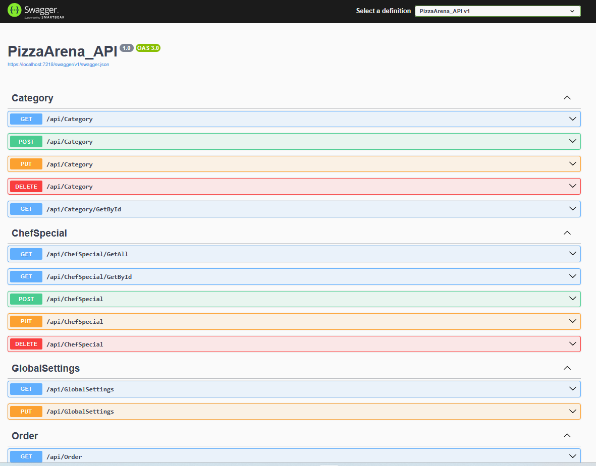

# PizzArena API (Backend)

Ez a projekt a **PizzArena** rendszer kiszolgáló oldala (REST API). Felelős a felhasználók hitelesítéséért, az adatok tárolásáért és a logika kiszolgálásáért a WPF admin panel és weboldala számára.

## Funkciók

* **Identity Kezelés:** Regisztráció, Bejelentkezés és Role-alapú jogosultságkezelés (Admin/User).
* **Adatkezelés:** CRUD műveletek a felhasználókhoz, termékekhez és rendelésekhez.
* **Validáció:** Szigorú szerveroldali ellenőrzés (pl. jelszó komplexitás).
* **Hibakezelés:** Egységes JSON válaszformátum hiba esetén is.

## Adatbázis sémája

Az adatbázis az **Entity Framework Core Migrations** segítségével épül fel. Tartalmazza a következő főbb táblákat:
* `AspNetUsers`: Felhasználói adatok és titkosított jelszavak.
* `Orders`: Rendelések fejléce.
* `OrderItems`: Rendelési tételek és kapcsolat a termékekkel.
* `Products` : Termékek.
* `Categories` : Termékekhez kapcsolódó kategória (pl. Pizza,Üdítő)
* `ChefSpecials` : Séf ajánlatok
* `GlobalSettings` : Globális beállítások (pl. Instagram URL)
* `Restaurants` : Éttermek és azok adatai

## Helyi futtatás (Setup)

1.  **ConnectionString beállítása:** Frissítsd az `appsettings.json` fájlban a `DefaultConnection` értékét a saját SQL Server elérésedre.
2.  **Admin,Globális beállítások:** Az `appsettings.json` fájlban állítsd be az alapértelmezett admint és az alapértelmezett globális beállításokat (WPF Admin felületen később is módosítható).
3.  **Adatbázis létrehozása:**
    Futtasd a következő parancsot a *Package Manager Console*-ban:
    update-database
4.  **Indítás:** Nyomj `F5`-öt a Visual Studio-ban. A böngészőben automatikusan megnyílik a **Swagger UI**.

